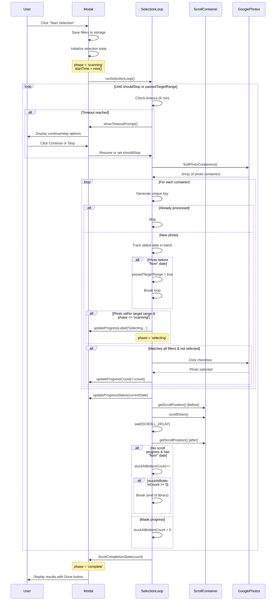
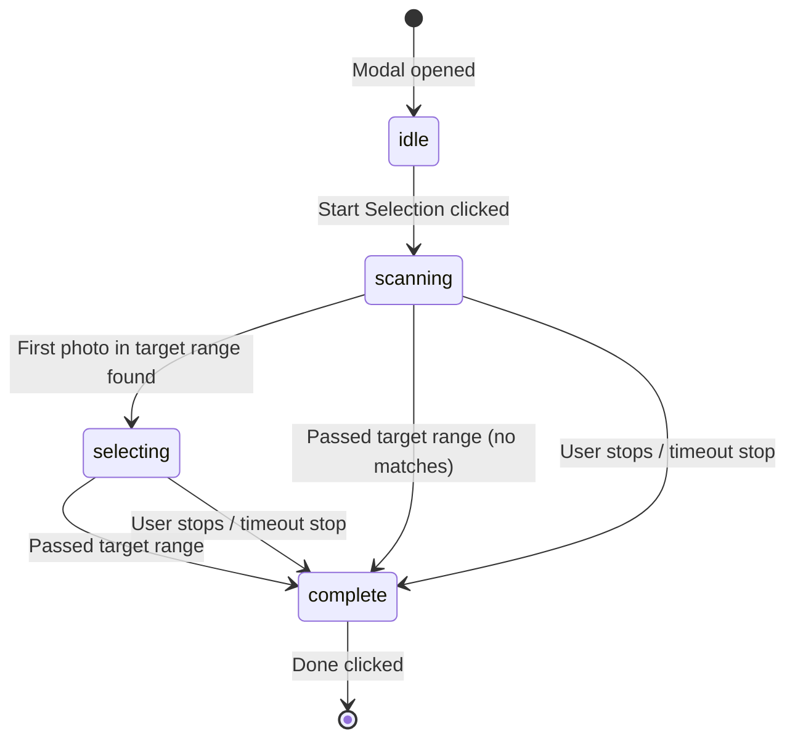

# Selection Process Sequence Diagram

## Overview

This document describes the flow of the photo selection process, including infinite scroll handling, phase transitions, and timeout management.

## Sequence Diagram



## Phase Transitions



## Key Components

### Selection State
```javascript
{
  isRunning: boolean,      // Selection loop active
  count: number,           // Photos selected
  shouldStop: boolean,     // User requested stop
  phase: string,           // 'idle' | 'scanning' | 'selecting' | 'complete'
  currentDateViewing: Date, // Oldest photo date in current batch
  startTime: number,       // For timeout tracking
  isPaused: boolean        // Waiting for timeout decision
}
```

### Timing Constants
| Constant | Value | Purpose |
|----------|-------|---------|
| CLICK_DELAY | 17ms | Wait between checkbox clicks |
| SCROLL_DELAY | 200ms | Wait after scrolling for content load |
| TIMEOUT_MS | 360000ms (6 min) | Show timeout prompt |
| MAX_STUCK_AT_BOTTOM | 5 | Retry attempts before giving up |

### Stop Conditions

1. **User stops** - Clicks Stop button or timeout Stop
2. **Passed target range** - Photo date < "from" date filter
3. **End of library** - 5 consecutive scroll attempts with no progress
4. **No "from" date** - Falls back to original behavior (3 no-new-photos cycles or bottom reached)

## Scroll Container Detection

Google Photos uses a custom scrollable container. The extension detects it by trying:
1. `[role="main"]`
2. `.yDSiEe` (Google's scroller class)
3. `[jsname="Zppfte"]`
4. Walk up from photo container to find scrollable parent
5. Fallback to `document.documentElement`
